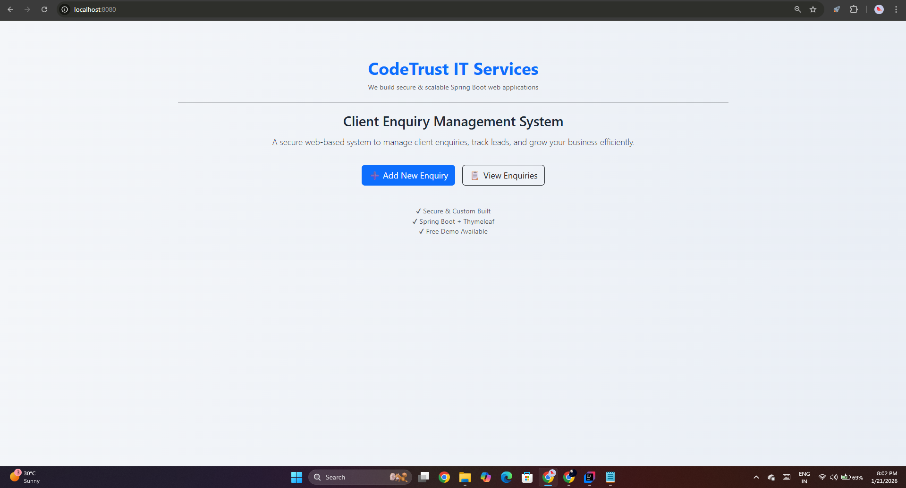
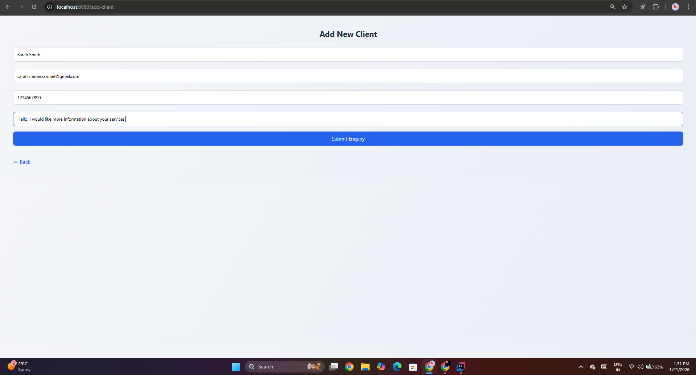
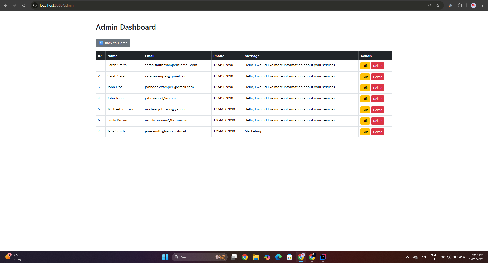
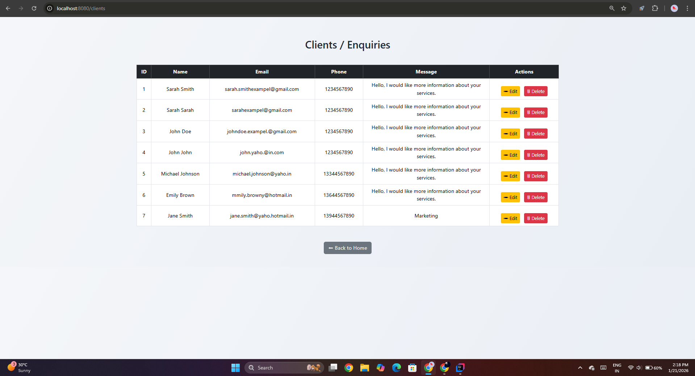
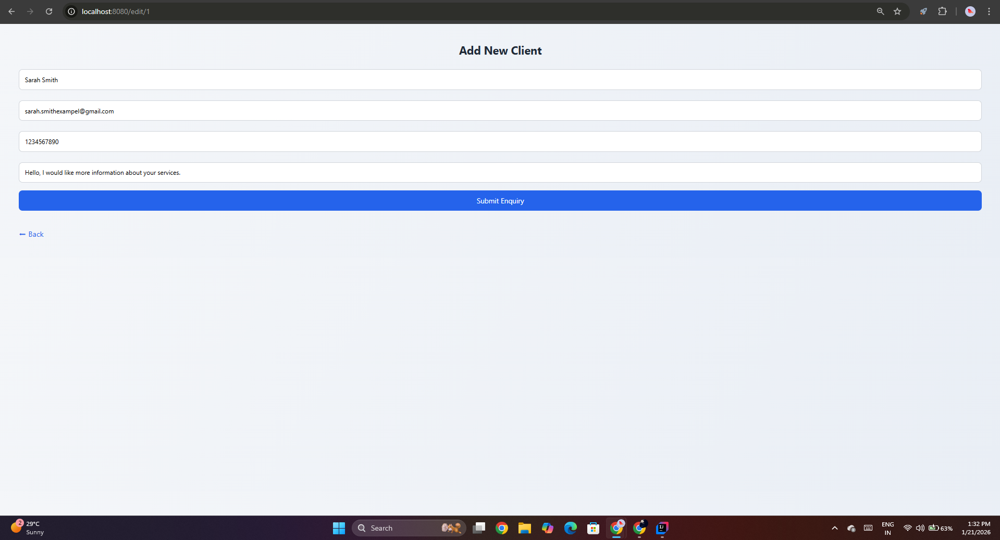

# 🚀 Client Enquiry Management System

**By CodeTrust IT Services**
A simple, fast, and reliable web application to manage client enquiries for small businesses, service providers, and startups.

---

## 🌐 About This Project

This project is built **for clients**, not recruiters.

Many small businesses receive enquiries from:

* Contact forms
* WhatsApp / Email
* Website visitors

But they **lose data**, forget follow‑ups, or manage everything in Excel.

👉 This system solves that problem.

---

## 🎯 What This Application Does

✔ Collect client enquiries from website
✔ Store enquiries securely in database
✔ View all enquiries in one dashboard
✔ Edit / update client details
✔ Delete old or fake enquiries
✔ Simple & clean UI (easy for non‑technical users)

---

## 🧑‍💼 Who Is This For?

This application is perfect for:

* Coaching classes
* IT service providers
* Freelancers
* Small businesses
* Local service agencies

If you get **daily enquiries**, this system saves time and looks professional.

---

## 🛠️ Tech Stack Used

**Backend**

* Java 21
* Spring Boot 3
* Spring MVC
* Spring Data JPA

**Frontend**

* Thymeleaf
* Bootstrap 5
* HTML & CSS

**Database**

* H2 (can be upgraded to MySQL)

**Deployment**

* GitHub
* Railway (Free deployment)

---

## 📸 Screenshots

### 🏠 Home Page

### ➕ Add Client / Enquiry Page

### * Admin / Enquiry Page

### 📋 Client List Dashboard

### ✏️ Update Enquiry Page

---

## ⚙️ Features in Detail

### ➕ Add Client / Enquiry

Clients can submit their details using a simple form.

### 📋 View All Clients

Admin can view all enquiries in a clean table layout.

### ✏️ Edit Client

Update client details from the same form.

### 🗑️ Delete Client

Remove unwanted or fake enquiries.

---

## 🚀 Live Demo

🔗 **Live Application:**
(https://client-enquiry-management-system-production.up.railway.app/)

---

## 🏢 About CodeTrust IT Services

**CodeTrust IT Services** provides:

* Website development
* Backend systems
* Custom business applications
* IT solutions for small businesses

We focus on **simple, affordable, and scalable solutions**.

---

## 📞 Want This System for Your Business?

We can customize this project as per your needs:

* MySQL database
* Login & authentication
* Admin roles
* Email notifications
* WhatsApp integration

📩 Contact CodeTrust IT Services to get started.

---

## 📄 License

This project is owned and maintained by **CodeTrust IT Services**.

Commercial use allowed only with permission.

---

**Built with ❤️ by CodeTrust IT Services**
